Explore the AFLW dataset 2017/2018
================
Anna Quaglieri

-   [Data source](#data-source)
-   [How to download and play with the material in this folder](#how-to-download-and-play-with-the-material-in-this-folder)
-   [What you will learn](#what-you-will-learn)
-   [Categorical, Discrete, and Continuous variables](#categorical-discrete-and-continuous-variables)
-   [Summarise and display Categorical Variables: frequency tables and barplots](#summarise-and-display-categorical-variables-frequency-tables-and-barplots)
-   [Discrete and continuous variables: summary statistics, histograms ans boxplots](#discrete-and-continuous-variables-summary-statistics-histograms-ans-boxplots)
    -   [From summary statistics to histogram](#from-summary-statistics-to-histogram)
-   [Summarise and plot continuous variables by levels of a categorical variables](#summarise-and-plot-continuous-variables-by-levels-of-a-categorical-variables)
-   [Explore the relashionship between two discrete variables: Scatterplot](#explore-the-relashionship-between-two-discrete-variables-scatterplot)
-   [Now have a go with the Shiny App!!](#now-have-a-go-with-the-shiny-app)

Data source
===========

-   Scraped data and original Shiny App (code at the end of this tutorial) were created at <https://github.com/ropenscilabs/ozwomensport/tree/master/AFLW>
-   The material used for this tutorial are now part of the [R-Forwards](https://forwards.github.io/) [teaching examples](https://github.com/forwards/teaching_examples).

How to download and play with the material in this folder
=========================================================

------------------------------------------------------------------------

1.  Go to the GitHub folder <https://github.com/annaquaglieri16/brainSTEMM>
2.  Click on the green button in the top right corner **Clone or Download**
3.  Select Download Zip

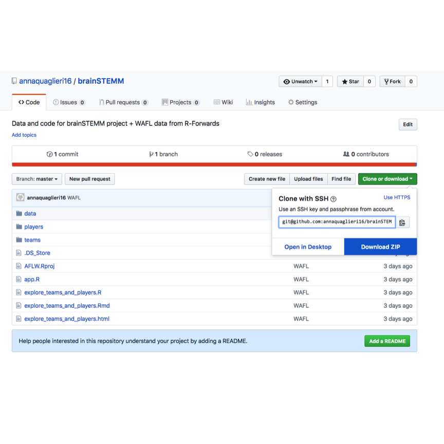

1.  Unzip the folder and double click on **AFLW.Rproj**. This will open and R studio session.

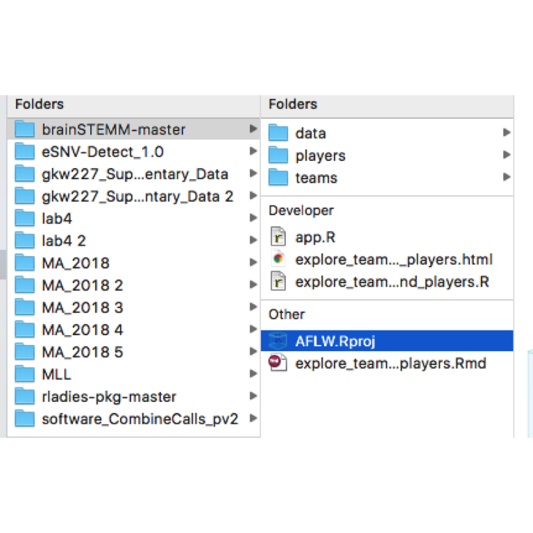

1.  Now you can see all the files (see picture below bottom right corner) and click on **Explore\_teams\_and\_players.R**

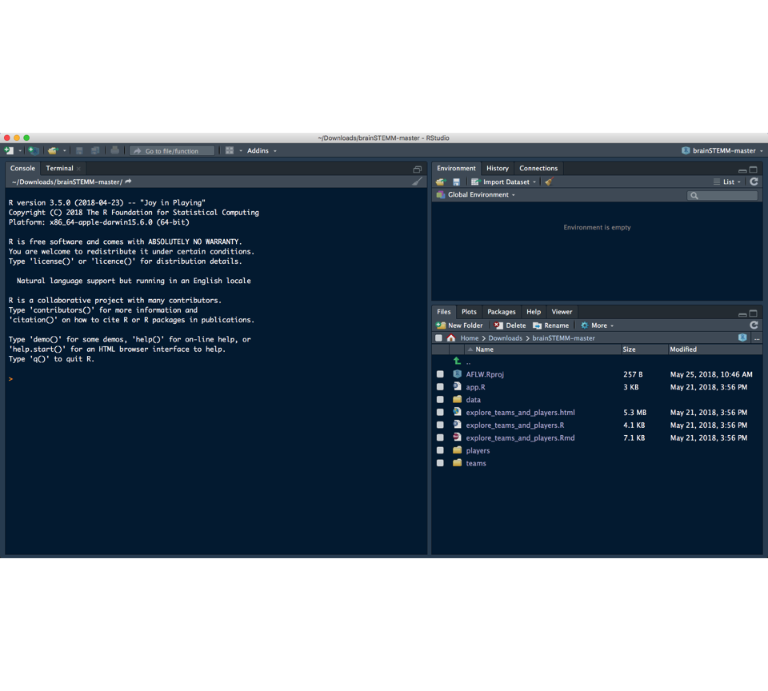

1.  The lines starting with \# are comments. Now try to run the R code and see what happens! To run the lines of R code you can put your cursor on the line that you want to run and either press the `Run` button in the topright corner or press `Command + Enter` or simply copy and paste the code into the Console!!

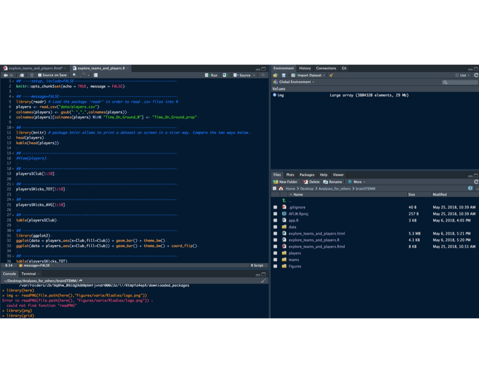

1.  If you want, outside of R Studio you can open the **Explore\_teams\_and\_players.html** file which contains all comments and results. Follow this document and run the R code and have fun!!!

What you will learn
===================

In this tutorial you will learn:

-   The difference between **categorical**, **discrete**, and **continuous** variables
-   How to summarise and graphically display each one them separately
-   How to summarise and plot these two types of variables together

You will learn these statistical concepts and techniques by exploring the AFL Women dataset taken from the 2017 and 2018 season.

Categorical, Discrete, and Continuous variables
===============================================

We refer to a **variable** as to a set of observations. For example, imagine collecting the **Age** from all students in your class. The list of all the ages of your friends can recorded into a column of an excel spreadsheet and you will refer to it as to **variable Age**. Each entry ( = row, age for one student) of the variable age is referred to as **observation**.

-   **Categorical variables** contain a finite number of categories or distinct groups. For example, the name of the football team, the gender of the player, the colour of the team. These variables are not intrinsically number.

-   **Discrete variables** are numeric variables that have a countable number of values between any two values. A discrete variable is always numeric. For example, the number of customer visiting a pharmacy in a day, the number of players in a team, the number of siblings per student in your class.

-   **Continuous variables** are numeric variables that have an infinite number of values between any two values. A continuous variable can be numeric or date/time. For example, the heigths of trees in your school, the time when you wake up in the morning.

Let's read the AFLW spreadsheet into R and test your understanding of the different types of variables.

Note1: *Each function that you use in R belongs to a package that you need to lead through before you can use that function*

Note2: We call **players** a dataset. You can see a dataset as a collection of variables (of any type!) put together in several columns next to each other. A dataset as a certain number of rows and columns.

Let's explore it!

First let's read the spreadsheet into R with the fucntion `read.csv()`

``` r
library(readr) # Load the package 'readr' in order to read .csv files into R
players <- read_csv("data/players.csv")
# The following two lines are simply a way to clean up the names of the columns
colnames(players) <- gsub(" ","_",colnames(players))
colnames(players)[colnames(players) %in% "Time_On_Ground_%"] <- "Time_On_Ground_prop"
```

Print the first 5 roes of the `players` dataset.

``` r
library(knitr) # package knitr allows to print a dataset on screen in a nicer way. Compare the two ways below.
head(players) # print the first 5 rows of the dataset players
```

    ## # A tibble: 6 x 45
    ##   Player           Club  Kicks_TOT Kicks_AVG Handballs_TOT Handballs_AVG
    ##   <chr>            <chr>     <int>     <dbl>         <int>         <dbl>
    ## 1 Aasta O'Connor   WB            9       2.3            14           3.5
    ## 2 Abbey Holmes     ADEL         35       4.4            38           4.8
    ## 3 Aimee Schmidt    GWS          21       3              17           2.4
    ## 4 Ainslie Kemp     MELB         21       5.3             9           2.3
    ## 5 Akec Makur Chuot FRE          29       4.8             8           1.3
    ## 6 Alex Williams    GWS          47       6.7            20           2.9
    ## # ... with 39 more variables: Disposals_TOT <int>, Disposals_AVG <dbl>,
    ## #   Cont_Poss_TOT <int>, Cont_Poss_AVG <dbl>, Uncont_Poss_TOT <int>,
    ## #   Uncont_Poss_AVG <dbl>, `Disp_eff_%` <dbl>, Clangers_TOT <int>,
    ## #   Clangers_AVG <dbl>, Marks_TOT <int>, Marks_AVG <dbl>,
    ## #   Cont_marks_TOT <int>, Cont_marks_AVG <dbl>, Marks50_TOT <int>,
    ## #   Marks50_AVG <dbl>, `Hit-outs_TOT` <int>, `Hit-outs_AVG` <dbl>,
    ## #   Clearances_TOT <int>, Clearances_AVG <dbl>, Frees_For_TOT <int>,
    ## #   Frees_For_AVG <dbl>, Frees_Agst_TOT <int>, Frees_Agst_AVG <dbl>,
    ## #   Tackles_TOT <int>, Tackles_AVG <dbl>, `One_%s_TOT` <int>,
    ## #   `One_%s_AVG` <dbl>, Bounces_TOT <int>, Bounces_AVG <dbl>,
    ## #   Goals_TOT <int>, Goals_AVG <dbl>, Behinds_TOT <int>,
    ## #   Behinds_AVG <dbl>, Goal_assists_TOT <int>, Goal_assists_AVG <dbl>,
    ## #   `Goal_acc_%` <dbl>, Matches <int>, Time_On_Ground_prop <dbl>,
    ## #   Year <int>

``` r
kable(head(players))
```

| Player           | Club |  Kicks\_TOT|  Kicks\_AVG|  Handballs\_TOT|  Handballs\_AVG|  Disposals\_TOT|  Disposals\_AVG|  Cont\_Poss\_TOT|  Cont\_Poss\_AVG|  Uncont\_Poss\_TOT|  Uncont\_Poss\_AVG|  Disp\_eff\_%|  Clangers\_TOT|  Clangers\_AVG|  Marks\_TOT|  Marks\_AVG|  Cont\_marks\_TOT|  Cont\_marks\_AVG|  Marks50\_TOT|  Marks50\_AVG|  Hit-outs\_TOT|  Hit-outs\_AVG|  Clearances\_TOT|  Clearances\_AVG|  Frees\_For\_TOT|  Frees\_For\_AVG|  Frees\_Agst\_TOT|  Frees\_Agst\_AVG|  Tackles\_TOT|  Tackles\_AVG|  One\_%s\_TOT|  One\_%s\_AVG|  Bounces\_TOT|  Bounces\_AVG|  Goals\_TOT|  Goals\_AVG|  Behinds\_TOT|  Behinds\_AVG|  Goal\_assists\_TOT|  Goal\_assists\_AVG|  Goal\_acc\_%|  Matches|  Time\_On\_Ground\_prop|  Year|
|:-----------------|:-----|-----------:|-----------:|---------------:|---------------:|---------------:|---------------:|----------------:|----------------:|------------------:|------------------:|-------------:|--------------:|--------------:|-----------:|-----------:|-----------------:|-----------------:|-------------:|-------------:|--------------:|--------------:|----------------:|----------------:|----------------:|----------------:|-----------------:|-----------------:|-------------:|-------------:|-------------:|-------------:|-------------:|-------------:|-----------:|-----------:|-------------:|-------------:|-------------------:|-------------------:|-------------:|--------:|-----------------------:|-----:|
| Aasta O'Connor   | WB   |           9|         2.3|              14|             3.5|              23|             5.8|               12|              3.0|                 12|                3.0|          65.2|              8|            2.0|           4|         1.0|                 0|               0.0|             2|           0.5|             24|              6|                0|              0.0|                1|              0.3|                 3|               0.8|             6|           1.5|             6|           1.5|             0|           0.0|           1|         0.3|             0|           0.0|                   1|                 0.3|           100|        4|                    73.6|  2017|
| Abbey Holmes     | ADEL |          35|         4.4|              38|             4.8|              73|             9.1|               51|              6.4|                 27|                3.4|          52.1|             17|            2.1|           9|         1.1|                 4|               0.5|             2|           0.3|              0|              0|                5|              0.6|                8|              1.0|                 2|               0.3|            16|           2.0|             5|           0.6|             0|           0.0|           2|         0.3|             2|           0.3|                   2|                 0.3|            40|        8|                    64.5|  2017|
| Aimee Schmidt    | GWS  |          21|         3.0|              17|             2.4|              38|             5.4|               13|              1.9|                 23|                3.3|          55.3|              8|            1.1|          15|         2.1|                 1|               0.1|             3|           0.4|              0|              0|                0|              0.0|                1|              0.1|                 3|               0.4|             9|           1.3|             5|           0.7|             0|           0.0|           3|         0.4|             0|           0.0|                   0|                 0.0|            50|        7|                    82.4|  2017|
| Ainslie Kemp     | MELB |          21|         5.3|               9|             2.3|              30|             7.5|               18|              4.5|                 12|                3.0|          50.0|              6|            1.5|           8|         2.0|                 5|               1.3|             3|           0.8|              0|              0|                3|              0.8|                1|              0.3|                 2|               0.5|             8|           2.0|             0|           0.0|             0|           0.0|           0|         0.0|             2|           0.5|                   1|                 0.3|             0|        4|                    63.7|  2017|
| Akec Makur Chuot | FRE  |          29|         4.8|               8|             1.3|              37|             6.2|               20|              3.3|                 16|                2.7|          48.6|              8|            1.3|           2|         0.3|                 1|               0.2|             0|           0.0|              6|              1|                5|              0.8|                0|              0.0|                 2|               0.3|            13|           2.2|            11|           1.8|             1|           0.2|           0|         0.0|             0|           0.0|                   0|                 0.0|             0|        6|                    64.9|  2017|
| Alex Williams    | GWS  |          47|         6.7|              20|             2.9|              67|             9.6|               35|              5.0|                 23|                3.3|          59.7|             10|            1.4|           6|         0.9|                 0|               0.0|             0|           0.0|              0|              0|                4|              0.6|                8|              1.1|                 1|               0.1|            21|           3.0|            14|           2.0|             1|           0.1|           0|         0.0|             1|           0.1|                   1|                 0.1|             0|        7|                    88.6|  2017|

-   What type of variable is `Club`?

``` r
players$Club[1:10]
```

    ##  [1] "WB"   "ADEL" "GWS"  "MELB" "FRE"  "GWS"  "BL"   "GWS"  "COLL" "FRE"

-   What type of variable is `Kicks_TOT`?

``` r
players$Kicks_TOT[1:10]
```

    ##  [1]  9 35 21 21 29 47 29  7 63  4

-   What type of variable is `Kicks_AVG`?

``` r
players$Kicks_AVG[1:10]
```

    ##  [1] 2.3 4.4 3.0 5.3 4.8 6.7 3.6 1.8 9.0 1.3

Summarise and display Categorical Variables: frequency tables and barplots
==========================================================================

-   Use **frequency tables** to summarise categorical variables

``` r
table(players$Club)
```

    ## 
    ## ADEL   BL CARL COLL  FRE  GWS MELB   WB 
    ##   57   58   59   58   62   60   58   57

-   Use **barplot** to plot catorical variables

A barplot usually contains a set of labels on the x-axis corresponding to the categories of the variable and on the y-axis is the number of times each category of the variable appears in the dataset.

``` r
barplot(table(players$Club),main="Number of players in each club")
```

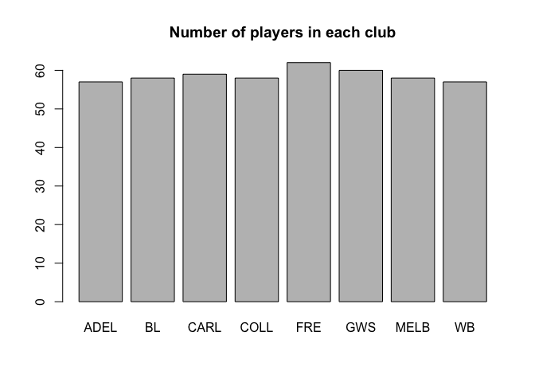

Below is another way in which you can plot this data using the `ggplot()` function. It might look more complicated at first but don't worry, try to run the code and see what happens!!

An Introduction to `ggplot()` is provided in Di Cook's tutorial <https://ebsmonash.shinyapps.io/foRwards_Girls_Coding_Workshop/#section-grammar-of-graphics>.

Compare the following two plots:

-   `geom_bar()` is used to produce the barplot
-   `theme_bw()` is purely aestethic and simply adds a white background
-   What does `fill=Club` do?
-   What does `coord_flip()` do?

``` r
library(ggplot2)
ggplot(data = players,aes(x=Club,fill=Club)) + geom_bar() + theme_bw()
```

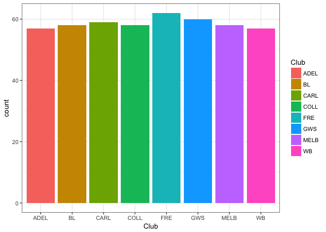

``` r
ggplot(data = players,aes(x=Club,fill=Club)) + geom_bar() + theme_bw() + coord_flip()
```

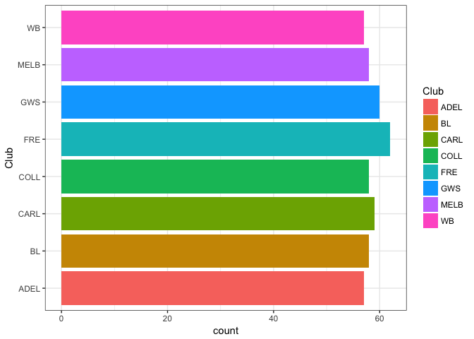

Discrete and continuous variables: summary statistics, histograms ans boxplots
==============================================================================

Discrete and continuous variables are usually summarised and displayed using similar tools. Often, discrete variables can be seen as special case of continuous variables.

From summary statistics to histogram
------------------------------------

-   Which one of the following summary stastics do you prefer for the number of total kicks?
-   Are you familiar with the concepts of *mean*, *median*, *quantiles*?

``` r
table(players$Kicks_TOT)
```

    ## 
    ##   0   1   2   3   4   5   6   7   8   9  10  11  12  13  14  15  16  17 
    ##  40   5   3   9  10  11   9   9  13   6  10  10   4   3   9   7   5   6 
    ##  18  19  20  21  22  23  24  25  26  27  28  29  30  31  32  33  34  35 
    ##   8   6   5   9   7   6   8   5   4   5   8   9   7   4   5   6   8  10 
    ##  36  37  38  39  40  41  42  43  44  45  46  47  48  49  50  51  52  53 
    ##   9   7   5  10   5  10   3   8   6   8  10   6   8   4   3   2   7   2 
    ##  54  55  56  57  58  59  60  61  63  64  65  66  67  68  69  71  72  73 
    ##   4   1   1   4   1   2   4   3   2   2   2   1   4   2   1   1   2   1 
    ##  74  75  76  78  79  81  82  84  85  86  87  89  91  96  97 101 102 105 
    ##   1   2   1   1   2   1   3   1   2   1   2   2   1   2   1   1   2   1 
    ## 123 124 
    ##   1   1

``` r
summary(players$Kicks_TOT)
```

    ##    Min. 1st Qu.  Median    Mean 3rd Qu.    Max. 
    ##    0.00   10.00   28.00   30.23   44.00  124.00

-   Use **histograms** to plot continuous/discrete variables

``` r
hist(players$Kicks_TOT,main="Total number of kicks")
```

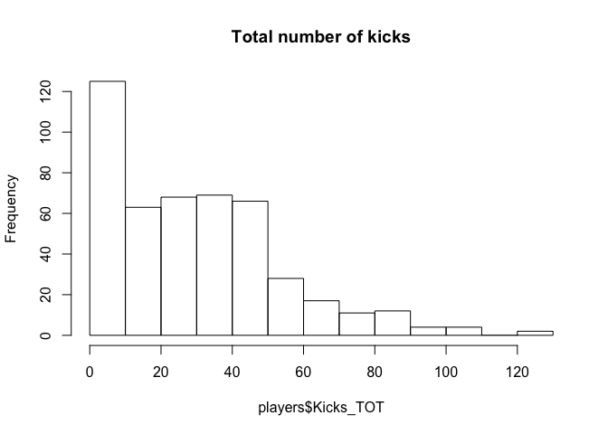

Again, have a try to plot the function with `ggplot()`

``` r
ggplot(data = players,aes(x=Kicks_TOT)) + geom_histogram(colour="white") + theme_bw()
```

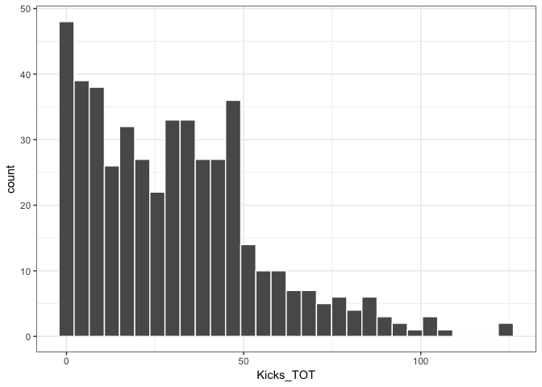

Summarise and plot continuous variables by levels of a categorical variables
============================================================================

The following code might look more complicated but again, try to run it and try to interpret the result!

For example, summarise the number of total kicks per AFL team.

1.  Create a table containing the number of total kicks kicked by a team per each year and save it into a new object kicks\_by\_team

You can find more details about the functions `group_by()` and `summarise()` and `%>%` in Di Cook's tutorial <https://ebsmonash.shinyapps.io/foRwards_Girls_Coding_Workshop/#section-wrangling-verbs>.

``` r
library(dplyr)
kicks_by_team <- players %>% group_by(Year,Club) %>%
summarise(Tot.kicks = sum(Kicks_TOT))
kicks_by_team
```

    ## # A tibble: 16 x 3
    ## # Groups:   Year [?]
    ##     Year Club  Tot.kicks
    ##    <int> <chr>     <int>
    ##  1  2017 ADEL       1052
    ##  2  2017 BL          977
    ##  3  2017 CARL        780
    ##  4  2017 COLL        838
    ##  5  2017 FRE         817
    ##  6  2017 GWS         758
    ##  7  2017 MELB        911
    ##  8  2017 WB          706
    ##  9  2018 ADEL        906
    ## 10  2018 BL         1077
    ## 11  2018 CARL        757
    ## 12  2018 COLL        959
    ## 13  2018 FRE         850
    ## 14  2018 GWS         848
    ## 15  2018 MELB        894
    ## 16  2018 WB         1050

1.  Per Club, plot number of kicks.

``` r
ggplot(data = players,aes(x = Club, y = Kicks_TOT)) + geom_bar(position="dodge",stat="identity") + theme_bw() + facet_wrap(~Year)
```

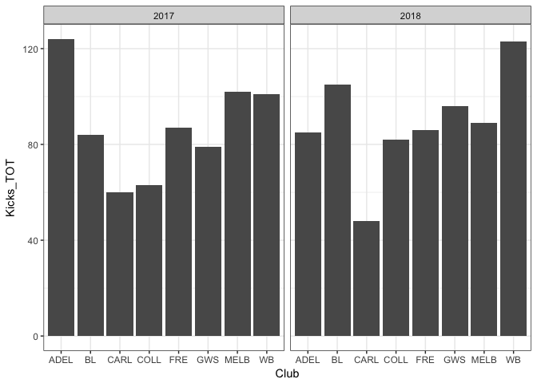

``` r
# Add title
ggplot(data = players,aes(x = Club, y = Kicks_TOT,fill=factor(Year))) + geom_bar(position="dodge",stat="identity") + theme_bw() + ggtitle("Total kicks by club by year (2017-1018)")
```

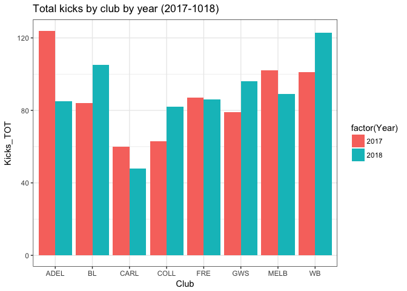

``` r
# Flip coordinate and colour by year
ggplot(data = players,aes(x = Club, y = Kicks_TOT,fill=factor(Year))) + geom_bar(position="dodge",stat="identity") + theme_bw() + ggtitle("Total kicks by club by year (2017-1018)") + coord_flip()
```

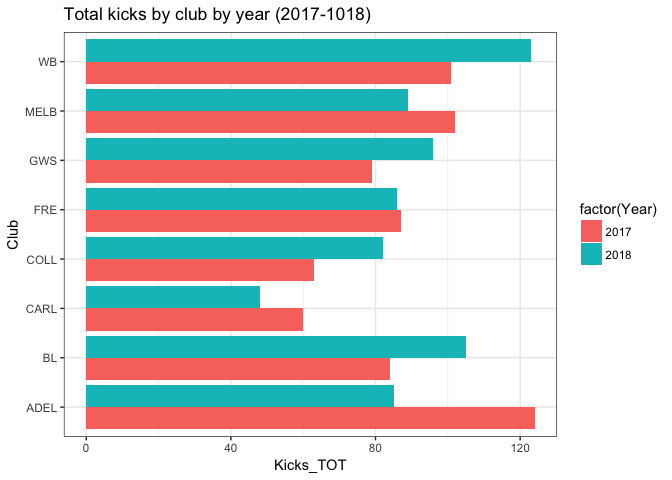

``` r
# Plot total number of goals instead of kicks
ggplot(data = players,aes(x = Club, y = Goals_TOT,fill=factor(Year))) + geom_bar(position="dodge",stat="identity") + theme_bw() + ggtitle("Total kicks by club by year (2017-1018)") + coord_flip()
```

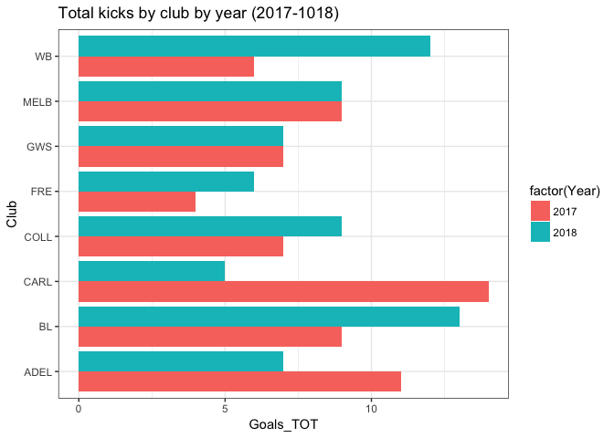

Explore the relashionship between two discrete variables: Scatterplot
=====================================================================

``` r
# Kicks by goal
ggplot(data = players,aes(x = Kicks_TOT, y = Goals_TOT)) + geom_point() + theme_bw() + ggtitle("Total kicks by Total goals (2017-1018)") + coord_flip()
```


``` r
ggplot(data = players,aes(x = Kicks_TOT, y = Goals_TOT)) + geom_point() + theme_bw() + ggtitle("Total kicks by Total goals (2017-1018)") + coord_flip() + facet_wrap(~Year)
```

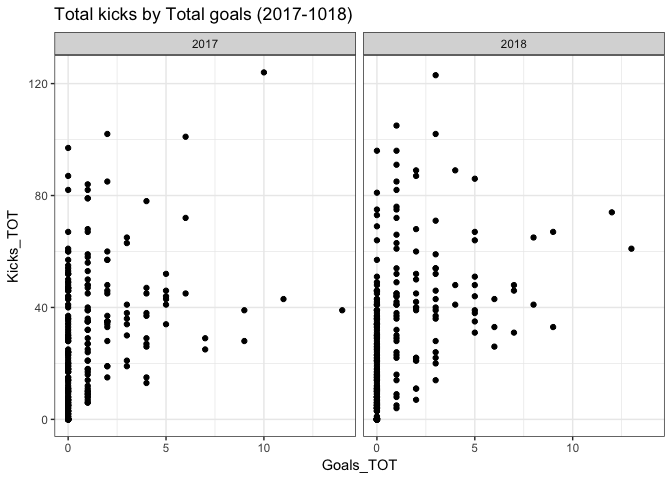

``` r
# Kicks by handballs
ggplot(data = players,aes(x = Kicks_TOT, y = Handballs_TOT)) + geom_point() + theme_bw() + ggtitle("Total kicks by Total goals (2017-1018)") + coord_flip()
```

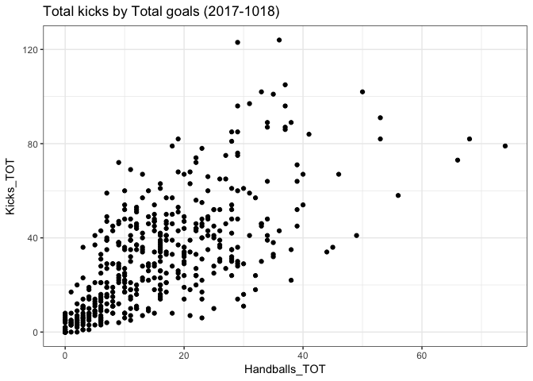

``` r
ggplot(data = players,aes(x = Kicks_TOT, y = Handballs_TOT)) + geom_point() + theme_bw() + ggtitle("Total kicks by Total goals (2017-1018)") + coord_flip() + facet_wrap(~Year)
```

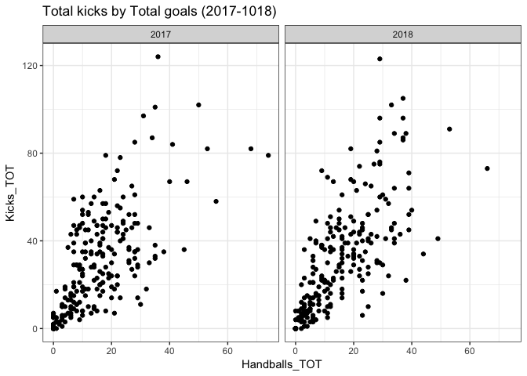

-   What can you say about these plots? Is there a relationship between the number of handballs per player and the number of kicks?

-   An example of interactive plot

``` r
library(plotly)

ggplotly(ggplot(data = players,aes(x = Kicks_TOT, y = Handballs_TOT,label=Player,label=Club)) + geom_point() + theme_bw() + ggtitle("Total kicks by Total goals (2017-1018)") + coord_flip() + facet_wrap(~Year))
```

Now have a go with the Shiny App!!
==================================

Run all the following code and.... magic will happen!

You can click the green arrow pointing to wards right in the top right corner of the following chunk to run all the code at once!


By running all the code a web page will open and you can play around interactively with the AFLW data! To exit from the App press the `STOP` red button in top right corner of the console.

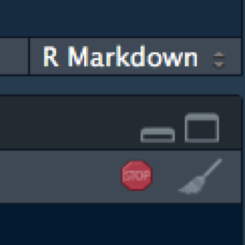

``` r
#
# This is a Shiny web application. You can run the application by clicking
# the 'Run App' button above.
#
# Find out more about building applications with Shiny here:
#
#    http://shiny.rstudio.com/
#

library(shiny)
library(shinydashboard)
library(shinythemes)
library(tidyverse)
library(plotly)

players <- read_csv("data/players.csv")
teams <- read_csv("data/teams.csv")
colnames(players) <- gsub(" ","_",colnames(players))
realvars <- c("Kicks_TOT", "Handballs_TOT", "Disposals_TOT", "Marks_TOT", "Frees_Agst_TOT", "Goals_TOT", "Behinds_TOT", "Goal_assists_TOT",
              "Time_On_Ground_prop")
colnames(players)[colnames(players) %in% "Time_On_Ground_%"] <- "Time_On_Ground_prop"
catvars <- c("Player", "Club")
clubs <- unique(players$Club)

# Define UI for application that draws a histogram
ui <- fluidPage(theme = shinytheme("flatly"),
  titlePanel("Exploring the AFLW statistics"),
    tabsetPanel(
      tabPanel("Data",
      # Sidebar with a slider input for number of bins
      sidebarLayout(
        sidebarPanel(
          selectInput('x', "X", realvars, realvars[1]),
          selectInput('y', "Y", realvars, realvars[2]),
          selectInput('label', "Label", catvars),
          radioButtons('clr', "Colour by club:", c("None", clubs))
        ),

        # Show a plot of the generated distribution
        mainPanel(
          plotlyOutput("scatterplot")
        )
      )
    ),
    tabPanel("Players",
     sidebarLayout(
       sidebarPanel(
         radioButtons('year', "Year", c("2017", "2018"), "2018"),
         checkboxGroupInput('vars', "Variables to use:", realvars, realvars[1:3])
        ),

        # Show a plot of the generated distribution
        mainPanel(
          plotlyOutput("mds")
        )
      )
    )
  )
)

# Define server logic required to draw a histogram
server <- function(input, output) {

   output$scatterplot <- renderPlotly({
     p <- ggplot(players,
            aes_string(x = input$x, y = input$y,
                       label = input$label)) +
       geom_point(alpha = 0.8) + labs(x=input$x,y=input$y)+
       facet_wrap(~Year, ncol=2) + theme_bw()
     if (input$clr != "None") {
       players$Clubclr <- "no"
       players$Clubclr[players$Club == input$clr] <- "yes"
       p <- p + aes(colour=players$Clubclr) +
         scale_colour_brewer(palette="Dark2",name=input$clr) +
         #theme(legend.position = "none")
         theme(legend.position = "bottom")+
         theme_bw()
     }
     ggplotly(p)
   })

   output$mds <- renderPlotly({
     players_sub <- players %>%
       filter(Year == input$year) %>%
       select(input$vars)
     players_sub_mat <- as.matrix(players_sub)
     players_mds <- cmdscale(dist(players_sub_mat), k=2)
     players_mds_df <- as_tibble(players_mds)
     players_mds_df$Player <- players$Player[players$Year == input$year]
     p2 <- ggplot(players_mds_df, aes(x=V1, y=V2, label=Player)) + geom_point() +theme_bw()
     ggplotly(p2, tooltip=c("label"))
   })

}

# Run the application
shinyApp(ui = ui, server = server)
```

``` r
purl("explore_teams_and_players.Rmd")
```
